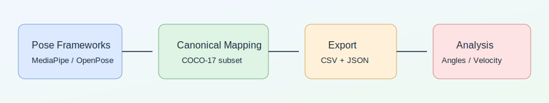

# Human Pose Estimation Experiments

[](https://www.python.org/)
[](https://colab.research.google.com/)
[](./.github/workflows/ci.yml)
[](./LICENSE)

This repository is a practical benchmark and analysis workspace for MediaPipe, OpenPose, AlphaPose, and Detectron2. It gives one consistent pipeline for cross-framework comparison, canonical keypoint export, and motion-signal analysis with reproducible artifacts.



## What this repo focuses on

- Running multiple pose frameworks with one benchmark contract.
- Mapping outputs to one canonical COCO-17 subset.
- Exporting stable CSV/JSON artifacts for downstream tasks.
- Building lightweight motion features from keypoint time series.

## Why this repo

Pose frameworks expose different keypoint definitions, confidence semantics, and output formats. Without a canonical mapping and export contract, speed and behavior comparisons are easy to misread.

This repository keeps comparison honest by enforcing shared schema, shared artifact structure, and explicit `not_measured` status whenever a tool cannot be measured in the current environment.

## What you will find here

- Canonical mapping utilities under `src/posebench/keypoints_schema.py`.
- Frame-level exporters with stable columns in `src/posebench/export.py`.
- Feature extraction utilities in `src/posebench/features.py`.
- Benchmark runner with environment capture in `scripts/run_benchmarks.py`.
- Colab-first notebooks for per-tool demos and cross-tool analysis.

## Repository layout

```text
.
├── MediaPipe/
├── OpenPose/
├── AlphaPose/
├── Detectron2/
├── notebooks/
├── src/posebench/
├── scripts/
├── results/
├── assets/
├── docs/
└── tests/
```

## Notebook index

| Notebook | Scope | Open in Colab |
| --- | --- | --- |
| `MediaPipe/01_mediapipe_pose_demo.ipynb` | MediaPipe inference, canonical mapping, export, mini benchmark | [Open](https://colab.research.google.com/github/sumeyye-agac/human-pose-estimation-experiments/blob/main/MediaPipe/01_mediapipe_pose_demo.ipynb) |
| `MediaPipe/02_mediapipe_export_and_features.ipynb` | Frame sequence export, angles, smoothing, velocity | [Open](https://colab.research.google.com/github/sumeyye-agac/human-pose-estimation-experiments/blob/main/MediaPipe/02_mediapipe_export_and_features.ipynb) |
| `Detectron2/01_detectron2_keypoints_demo.ipynb` | Detectron2 keypoint demo and export | [Open](https://colab.research.google.com/github/sumeyye-agac/human-pose-estimation-experiments/blob/main/Detectron2/01_detectron2_keypoints_demo.ipynb) |
| `OpenPose/01_openpose_install_and_run.ipynb` | OpenPose recommended path and synthetic fallback | [Open](https://colab.research.google.com/github/sumeyye-agac/human-pose-estimation-experiments/blob/main/OpenPose/01_openpose_install_and_run.ipynb) |
| `AlphaPose/01_alphapose_colab_inference.ipynb` | AlphaPose recommended path and synthetic fallback | [Open](https://colab.research.google.com/github/sumeyye-agac/human-pose-estimation-experiments/blob/main/AlphaPose/01_alphapose_colab_inference.ipynb) |
| `notebooks/01_benchmark_all_tools.ipynb` | Runs benchmark script and inspects generated artifacts | [Open](https://colab.research.google.com/github/sumeyye-agac/human-pose-estimation-experiments/blob/main/notebooks/01_benchmark_all_tools.ipynb) |
| `notebooks/02_keypoints_timeseries_analysis.ipynb` | Time-series angles, angular velocity, and compact features | [Open](https://colab.research.google.com/github/sumeyye-agac/human-pose-estimation-experiments/blob/main/notebooks/02_keypoints_timeseries_analysis.ipynb) |
| `notebooks/03_quality_metrics_without_ground_truth.ipynb` | Missing-rate, confidence, and temporal jitter diagnostics | [Open](https://colab.research.google.com/github/sumeyye-agac/human-pose-estimation-experiments/blob/main/notebooks/03_quality_metrics_without_ground_truth.ipynb) |

## Results snapshot

Generated from `results/benchmark.csv`. Only measured tools contain numbers.

<!-- BENCHMARK_SNAPSHOT_START -->
| Tool | Status | Avg ms/frame | Std ms/frame | FPS |
| --- | --- | --- | --- | --- |
| mediapipe | measured | 7.41 | 0.16 | 134.95 |
| detectron2 | measured | 1033.24 | 47.56 | 0.97 |
| openpose | measured | 429.79 | 5.90 | 2.33 |
| alphapose | not_measured | - | - | - |
<!-- BENCHMARK_SNAPSHOT_END -->

Full table and notes are in [`results/benchmark.md`](./results/benchmark.md).

## Quick start

### Colab

- Open a notebook from the table above.
- Setup cells clone the repo when needed and install dependencies idempotently.

### Local

```bash
git clone https://github.com/sumeyye-agac/human-pose-estimation-experiments.git
cd human-pose-estimation-experiments
python -m venv .venv
source .venv/bin/activate
python -m pip install --upgrade pip
pip install -r requirements-dev.txt
```

Validation commands:

```bash
ruff check .
pytest -q
python scripts/check_links.py --skip-remote
python scripts/verify_results_consistency.py
```

### Optional framework dependencies

- MediaPipe

```bash
pip install mediapipe==0.10.14 "numpy<2"
```

- Detectron2 (best effort)
  - Colab or Linux GPU flows can use the official install matrix.
  - macOS arm64 CPU can use `conda-forge` builds.

```bash
conda create -y -n posebench-d2 -c conda-forge python=3.10 detectron2
conda run -n posebench-d2 python -m pip install mediapipe==0.10.14 opencv-python-headless "setuptools<81"
```

- OpenPose and AlphaPose
  - Official installs can be fragile in ephemeral Colab sessions.
  - Notebooks include fallback paths for schema/export validation.
  - Fallback outputs are clearly labeled synthetic and never treated as real inference.

## Output format

All tools are mapped into a canonical COCO-17 subset.

- Schema and mapping details are in [`docs/schema.md`](./docs/schema.md).
- CSV contract includes `frame_index`, `timestamp_ms`, `person_id`, `tool`, `schema`, and per-keypoint `{name}_x`, `{name}_y`, `{name}_confidence` columns.

## Reproducibility and consistency

Benchmark artifacts are generated with:

```bash
python scripts/run_benchmarks.py --tool all
```

Generated artifacts:

- `results/benchmark.csv`
- `results/benchmark.md`
- `results/environment.json`
- `results/benchmark_raw_<tool>.json` for measured tools

`results/environment.json` records Python version, platform, optional GPU probe result, and key library versions for the run.

Method details are in [`docs/benchmark_methodology.md`](./docs/benchmark_methodology.md).

## Honest results policy

- Measured numbers are published only when a real adapter run finishes in the current environment.
- Unsupported or failed tools stay `not_measured` with a clear reason.
- Synthetic fallback outputs are labeled as synthetic and used only to validate pipeline contracts.
- No row is backfilled with guessed latency or FPS.

## Limitations and next steps

- AlphaPose remains `not_measured` on macOS arm64 CPU due official CUDA-dependent custom ops.
- OpenPose measurement currently uses OpenCV DNN with official COCO Caffe weights rather than `pyopenpose` runtime.
- Multi-person identity tracking is not yet part of the shared export contract.
- Current benchmark input is synthetic; next step is fixed real-video clips with published license.
- Cross-machine comparison still needs standardized runtime presets.

## References

- [MediaPipe Pose](https://ai.google.dev/edge/mediapipe/solutions/vision/pose_landmarker)
- [OpenPose (official)](https://github.com/CMU-Perceptual-Computing-Lab/openpose)
- [AlphaPose (official)](https://github.com/MVIG-SJTU/AlphaPose)
- [Detectron2 (official)](https://github.com/facebookresearch/detectron2)

## Author

- [GitHub](https://github.com/sumeyye-agac)
- [LinkedIn](https://www.linkedin.com/in/sumeyye-agac)
