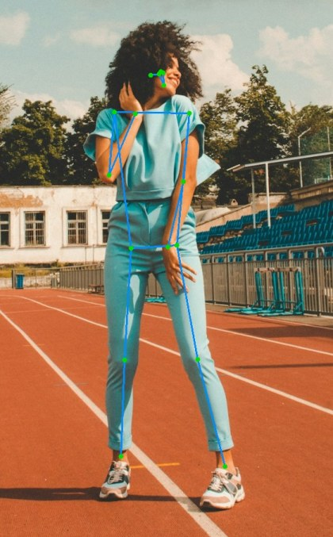
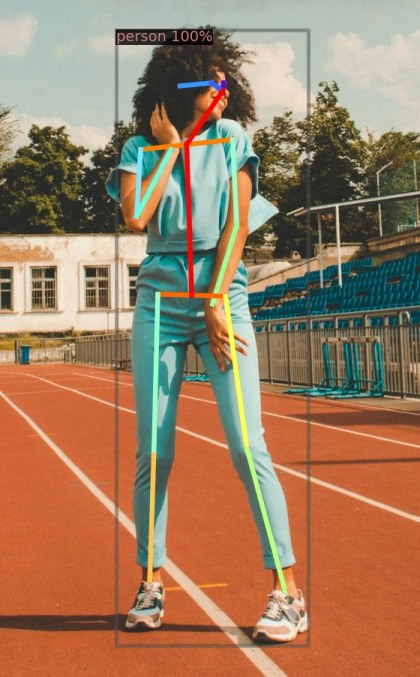
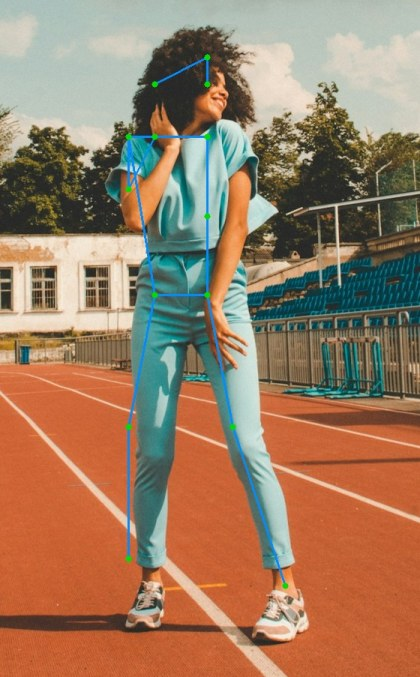
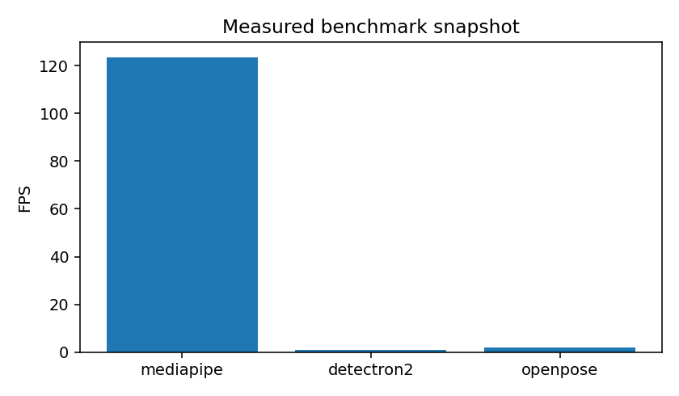
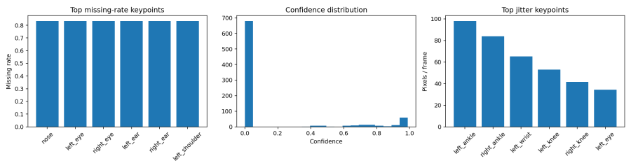

# Human Pose Estimation Experiments

[](https://www.python.org/)
[](https://colab.research.google.com/)
[](./LICENSE)

This repository is a practical benchmark and analysis workspace for MediaPipe, OpenPose, AlphaPose, and Detectron2. It gives one consistent pipeline for cross-framework comparison, canonical keypoint export, and motion-signal analysis with reproducible artifacts.

## What is built

- **One benchmark contract across four frameworks.** MediaPipe, Detectron2, and OpenPose are
  measured on identical input and settings; AlphaPose stays `not_measured` with a stated reason.
- **One canonical COCO-17 schema for every tool.** Separate index maps cover BlazePose's 33
  landmarks, OpenPose BODY_25, OpenPose's 18-part COCO output, and native COCO-17.
- **Real single-frame inference on one licensed photo.** Three tools resolve 16-17 of 17
  canonical joints on the same image and agree on the pose.
- **A stable CSV/JSON export contract** with fixed columns, so downstream code does not care
  which framework produced a row.
- **Latency benchmarks with captured environment metadata**, regenerated by one command.
- **Joint-angle, smoothing, and angular-velocity features**, plus label-free quality
  diagnostics (missing rate, confidence spread, temporal jitter).
- **CI on every push**: lint, unit tests, markdown link check, and a benchmark
  artifact consistency check.

## Why this repo

Pose frameworks expose different keypoint definitions, confidence semantics, and output formats. Without a canonical mapping and export contract, speed and behavior comparisons are easy to misread.

This repository keeps comparison honest by enforcing shared schema, shared artifact structure, and explicit `not_measured` status whenever a tool cannot be measured in the current environment.

## What you will find here

- Canonical mapping utilities under `src/posebench/keypoints_schema.py`.
- Frame-level exporters with stable columns in `src/posebench/export.py`.
- Feature extraction utilities in `src/posebench/features.py`.
- Benchmark runner with environment capture in `scripts/run_benchmarks.py`.
- Colab-first notebooks for per-tool demos and cross-tool analysis.

## Repository layout

```text
.
├── MediaPipe/
├── OpenPose/
├── AlphaPose/
├── Detectron2/
├── notebooks/
├── src/posebench/
├── scripts/
├── results/
├── assets/
├── docs/
└── tests/
```

## Notebook index

| Notebook | Scope | Open in Colab |
| --- | --- | --- |
| `MediaPipe/01_mediapipe_pose_demo.ipynb` | MediaPipe inference, canonical mapping, export, mini benchmark | [Open](https://colab.research.google.com/github/sumeyye-agac/human-pose-estimation-experiments/blob/main/MediaPipe/01_mediapipe_pose_demo.ipynb) |
| `MediaPipe/02_mediapipe_export_and_features.ipynb` | Frame sequence export, angles, smoothing, velocity | [Open](https://colab.research.google.com/github/sumeyye-agac/human-pose-estimation-experiments/blob/main/MediaPipe/02_mediapipe_export_and_features.ipynb) |
| `Detectron2/01_detectron2_keypoints_demo.ipynb` | Detectron2 keypoint demo and export | [Open](https://colab.research.google.com/github/sumeyye-agac/human-pose-estimation-experiments/blob/main/Detectron2/01_detectron2_keypoints_demo.ipynb) |
| `OpenPose/01_openpose_install_and_run.ipynb` | OpenPose COCO weights via OpenCV DNN, canonical export, synthetic fallback | [Open](https://colab.research.google.com/github/sumeyye-agac/human-pose-estimation-experiments/blob/main/OpenPose/01_openpose_install_and_run.ipynb) |
| `AlphaPose/01_alphapose_colab_inference.ipynb` | AlphaPose recommended path and labeled synthetic fallback | [Open](https://colab.research.google.com/github/sumeyye-agac/human-pose-estimation-experiments/blob/main/AlphaPose/01_alphapose_colab_inference.ipynb) |
| `notebooks/01_benchmark_all_tools.ipynb` | Runs benchmark script and inspects generated artifacts | [Open](https://colab.research.google.com/github/sumeyye-agac/human-pose-estimation-experiments/blob/main/notebooks/01_benchmark_all_tools.ipynb) |
| `notebooks/02_keypoints_timeseries_analysis.ipynb` | Time-series angles, angular velocity, and compact features | [Open](https://colab.research.google.com/github/sumeyye-agac/human-pose-estimation-experiments/blob/main/notebooks/02_keypoints_timeseries_analysis.ipynb) |
| `notebooks/03_quality_metrics_without_ground_truth.ipynb` | Missing-rate, confidence, and temporal jitter diagnostics | [Open](https://colab.research.google.com/github/sumeyye-agac/human-pose-estimation-experiments/blob/main/notebooks/03_quality_metrics_without_ground_truth.ipynb) |

## Demo image

All four per-tool notebooks run on the same input, `assets/pose_demo_full_body.jpg`:
one standing person, whole body visible, no occlusion of the limbs. That makes every
canonical COCO-17 joint reachable, so a missing keypoint means the tool missed it
rather than the frame not containing it.

Photo by Valerie Elash on Unsplash, used under the Unsplash License. The file is not
committed; notebooks download it on first run. Source URL, license, and a manual
`curl` command are in [`assets/SOURCES.md`](./assets/SOURCES.md).

### Per-tool demo results

Read from the committed artifacts in `results/<tool>_demo_keypoints.csv`.

| Tool | Runtime used | Canonical keypoints resolved | Mean confidence | Missing |
| --- | --- | --- | --- | --- |
| mediapipe | BlazePose, `mediapipe==0.10.14` | 17 / 17 | 0.99 | - |
| detectron2 | `keypoint_rcnn_R_50_FPN_3x`, CPU | 16 / 17 | 0.43 | `left_ear` |
| openpose | COCO Caffe weights via OpenCV DNN | 16 / 17 | 0.77 | `left_ear` |
| alphapose | none - synthetic fallback | not applicable | not applicable | not applicable |

Notes:

- Confidence columns are **not comparable across tools**. MediaPipe reports landmark
  visibility, Detectron2 reports a raw keypoint heatmap score, and the OpenPose path
  reports a heatmap peak probability.
- The three real runs agree on the subject's pose and independently drop `left_ear`,
  which is covered by hair in this frame.
- AlphaPose has no runnable adapter in this environment, so its demo export stays a
  labeled synthetic sample and its overlay is stamped `SYNTHETIC - NOT MODEL OUTPUT`.

### Overlays

| MediaPipe | Detectron2 | OpenPose (OpenCV DNN) |
| --- | --- | --- |
|  |  |  |

Each row is drawn by the renderer that belongs to it: `posebench.viz.draw_skeleton` over the
canonical COCO-17 mapping for MediaPipe and OpenPose, and Detectron2's own `Visualizer` for
Detectron2. AlphaPose is absent because its demo output is a labeled synthetic sample, not
inference.

These are cropped to the subject and downscaled from the full-resolution overlays the
notebooks write into the untracked `assets/generated/`. Regenerate them with:

```bash
python scripts/make_readme_figures.py
```

## Results snapshot

Generated from `results/benchmark.csv`. Only measured tools contain numbers.

<!-- BENCHMARK_SNAPSHOT_START -->
| Tool | Status | Avg ms/frame | Std ms/frame | FPS |
| --- | --- | --- | --- | --- |
| mediapipe | measured | 8.09 | 0.16 | 123.61 |
| detectron2 | measured | 1244.15 | 148.28 | 0.80 |
| openpose | measured | 494.01 | 76.53 | 2.02 |
| alphapose | not_measured | - | - | - |
<!-- BENCHMARK_SNAPSHOT_END -->

Full table and notes are in [`results/benchmark.md`](./results/benchmark.md).



Only measured tools are plotted. The spread is the point: on this CPU the three measurable
runtimes cover roughly two orders of magnitude, so picking a framework by accuracy alone
without checking the latency budget is a mistake this chart makes hard to repeat.

## Signal quality diagnostics

`notebooks/03_quality_metrics_without_ground_truth.ipynb` screens an exported keypoint
sequence with no labels at all: missing rate per keypoint, confidence distribution, and
frame-to-frame jitter.



Numbers behind the figure are in
[`results/quality_metrics_summary.json`](./results/quality_metrics_summary.json).

Read the current values as a finding about the **input**, not the tool: the sequence clip
`assets/sample_input_motion.mp4` is a face-tracking test video rather than a full-body clip,
so the overall missing rate sits at 0.83. The diagnostics behave correctly; the clip is the
weak link, and replacing it is tracked below.

## Quick start

### Colab

- Open a notebook from the table above.
- Setup cells clone the repo when needed and install dependencies idempotently.
- Outside Colab the install cells are skipped, so a local runtime keeps the environment
  you built from `requirements-dev.txt` plus the optional framework packages below.

### Local

```bash
git clone https://github.com/sumeyye-agac/human-pose-estimation-experiments.git
cd human-pose-estimation-experiments
python -m venv .venv
source .venv/bin/activate
python -m pip install --upgrade pip
pip install -r requirements-dev.txt
```

Validation commands:

```bash
ruff check .
pytest -q
python scripts/check_links.py --skip-remote
python scripts/verify_results_consistency.py
```

### Optional framework dependencies

- MediaPipe

```bash
pip install mediapipe==0.10.14 "numpy<2"
```

- Detectron2 (best effort)
  - Colab or Linux GPU flows can use the official install matrix.
  - macOS arm64 CPU can use `conda-forge` builds.

```bash
conda create -y -n posebench-d2 -c conda-forge python=3.10 detectron2
conda run -n posebench-d2 python -m pip install mediapipe==0.10.14 opencv-python-headless "setuptools<81"
```

- OpenPose
  - The notebook does not compile `pyopenpose`. It downloads the official COCO Caffe
    weights into `.cache/models/` and runs them through OpenCV DNN, which needs no
    extra dependency beyond `opencv-python`.
  - Decoding is single-person argmax over the part heatmaps, without PAF grouping.
  - A labeled synthetic sample is used only when the weights cannot be downloaded.

- AlphaPose
  - Official installs can be fragile in ephemeral Colab sessions and require CUDA.
  - The notebook falls back to a schema/export validation path.
  - Fallback outputs are clearly labeled synthetic and never treated as real inference.

## Output format

All tools are mapped into a canonical COCO-17 subset.

- Schema and mapping details are in [`docs/schema.md`](./docs/schema.md).
- CSV contract includes `frame_index`, `timestamp_ms`, `person_id`, `tool`, `schema`, and per-keypoint `{name}_x`, `{name}_y`, `{name}_confidence` columns.

## Reproducibility and consistency

Benchmark artifacts are generated with:

```bash
python scripts/run_benchmarks.py --tool all
```

Generated artifacts:

- `results/benchmark.csv`
- `results/benchmark.md`
- `results/environment.json`
- `results/benchmark_raw_<tool>.json` for measured tools

`results/environment.json` records Python version, platform, optional GPU probe result, and key library versions for the run.

Method details are in [`docs/benchmark_methodology.md`](./docs/benchmark_methodology.md).

## Honest results policy

- Measured numbers are published only when a real adapter run finishes in the current environment.
- Unsupported or failed tools stay `not_measured` with a clear reason.
- Synthetic fallback outputs are labeled as synthetic and used only to validate pipeline contracts.
- No row is backfilled with guessed latency or FPS.

## Limitations

- AlphaPose is `not_measured` on macOS arm64 CPU because the official install requires
  CUDA-dependent custom ops. Its demo export is a labeled synthetic sample, not inference.
- OpenPose runs through OpenCV DNN with the official COCO Caffe weights, not the native
  `pyopenpose` runtime, so its latency is not comparable to published OpenPose numbers.
- OpenPose decoding is single-person argmax; PAF-based multi-person grouping is not implemented.
- Multi-person identity tracking is not part of the shared export contract.
- Confidence values are not comparable across tools; each framework uses its own scale.
- The latency benchmark uses a deterministic synthetic frame, so it measures runtime cost
  rather than behavior on real content.
- The time-series clip is a face-tracking test video, so full-body joints are missing in most
  frames of `notebooks/02` and `notebooks/03`.
- Numbers are single-machine. Nothing here supports cross-machine comparison yet.

## Future work

- Replace the time-series clip with a licensed full-body video, as already done for the demo
  image. This is the highest-value next change.
- Add fixed real-video benchmark clips alongside the synthetic frame.
- Add standardized runtime presets so results from different machines can be compared.
- Add decode-included and decode-excluded benchmark modes.
- Add multi-person association fields to the export contract.
- Extend the schema with optional 3D landmarks while preserving 2D compatibility.
